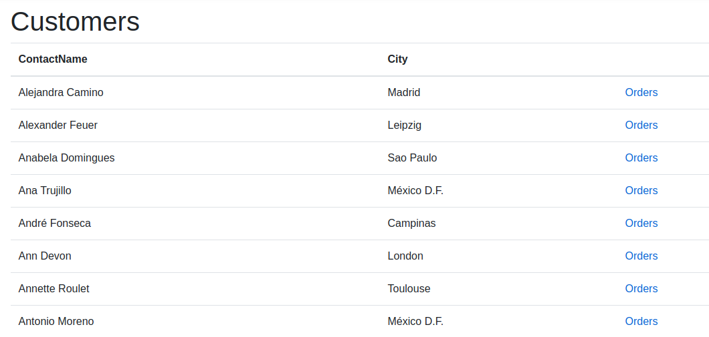
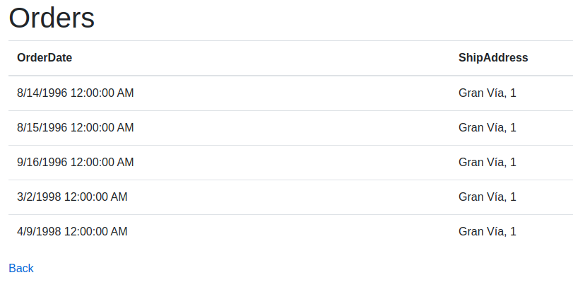

# Northwind app - MVC - Part I - Exercise
In this exercise you are going to build a basic MVC application.

# Purpose
Create a very basic MVC application that retrieves customers and their orders.

# Requirements

- An overview page where **all customers** are listed in a table.
- The last column of the table should contain an **orders link**.
- When clicking the orders link a new page is loaded with all the orders of that specific customer.
  - This should be displayed in a table again.
- See the screenshots at the bottom of this page.

# Start project
In this start project the code is already givin to retrieve orders, customers, and orders for specific customers. 
This functionality can be found in the **OrderService** and **CustomerService.**
- Some snippets to create tables are available in the folder snippets.

# How to start
- Open the cheat sheets.
- Turn this folder into a MVC application (which command do you use?).
- Import the database models with the **dotnet ef** command.
  - Don't forget to add the proper packages first.
- Create an **OverviewController** (or any name of choise)
  - Don't for get to add the package to easily create controller and views.
- This controller should contain at least two actions
  - A **Customers** action to show all the customers
  - A **GetOrdersyByCustomerId** action which displays all the orders for that specific customer.
  - Make **Customers** the default action.
  - Test these actions in postman or any rest client (browser).
- Create two views
  - A view to display all the customers.
    - Use the snippet.
    - Don't forget to at the proper razer syntac (@foreach, ...)
  - A view to display the all the orders for that specific customer.
    - Create a **link** to go back to the customers page.

# Screenshots
- **Customers**

- **Orders belonging to a customer**

